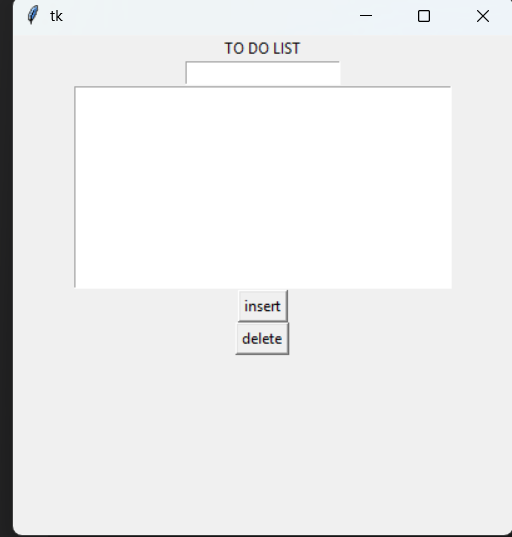

# Tkinter To-Do List App

A simple To-Do List application built with Python's Tkinter library.

## Features

- **Add Tasks:** Insert new tasks to your to-do list.
- **Delete Tasks:** Remove tasks from your list easily.

## Requirements

- Python 3.x

## How to Run

1. Clone or download this repository.
2. Run the main Python file:
    ```bash
    python main.py
    ```

## Screenshots


## License

This project is licensed under the MIT License.